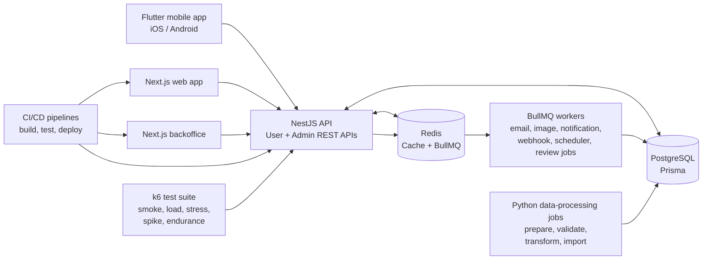
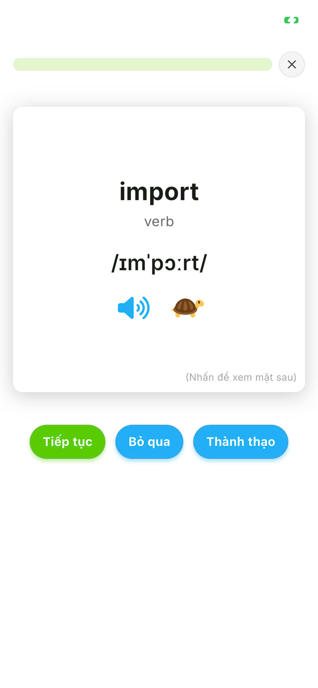
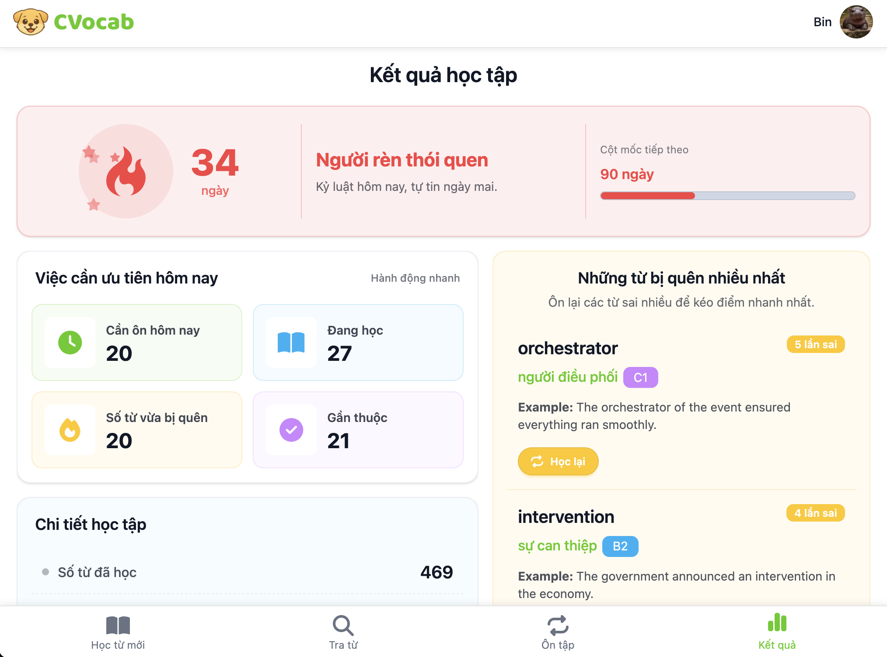
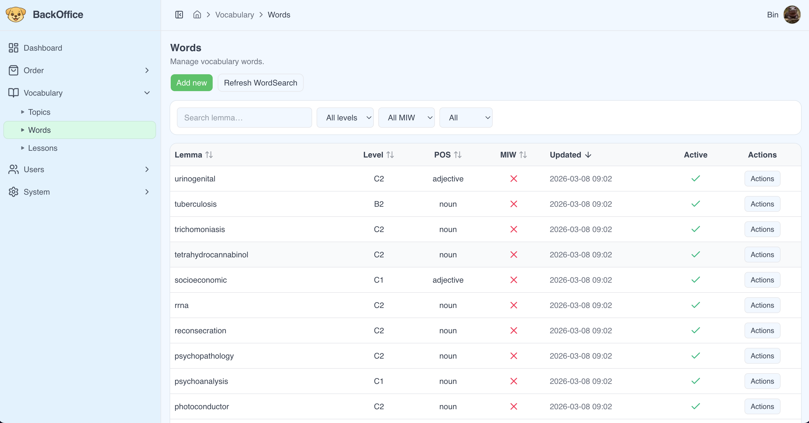

# CVocab

CVocab is an English vocabulary learning platform focused on structured learning, personalized review scheduling, and long-term retention. It is shipped on iOS, Android, and web.

This repository documents the project architecture, technical decisions, and engineering practices while keeping proprietary source code private.

## Project Overview

The project includes:

- Flutter mobile application for iOS and Android.
- NestJS backend APIs for mobile, web, and backoffice clients.
- Next.js web frontend and Next.js backoffice.
- PostgreSQL as the primary relational database.
- Redis for caching and BullMQ-backed background jobs.
- Background workers and internal data-processing jobs.
- CI/CD deployment pipelines.
- k6 smoke, load, stress, spike, and endurance tests for backend flows.

## Production Links

| Platform      | Link                                                                                                |
| ------------- | --------------------------------------------------------------------------------------------------- |
| Web           | [cvocab.app](https://cvocab.app)                                                                    |
| iOS App Store | [CVocab - English vocabulary](https://apps.apple.com/vn/app/cvocab-english-vocabulary/id6760455273) |
| Google Play   | [CVocab - English vocabulary](https://play.google.com/store/apps/details?id=app.cvocab)             |

## Production Highlights

- iOS app shipped to the App Store.
- Android app shipped to Google Play.
- Web platform shipped at `cvocab.app`.
- Backoffice platform for administration and operational workflows.
- CI/CD deployment pipelines for release-critical repositories.
- Automated smoke, load, stress, spike, and endurance testing with k6.

## My Role

CVocab is a team-built product. I worked as the owner and technical lead, designed the full system architecture, and was the main developer across the core production codebase.

Other team members contributed to English/business logic, data processing, design, testing, and implementation work. My responsibility was to keep the product and engineering direction coherent across the mobile app, web apps, backend, data-processing jobs, CI/CD, and performance testing.

## What This Repository Documents

- High-level system architecture and component boundaries.
- Engineering case studies for mobile, backend, web, backoffice, data processing, CI/CD, and performance testing.
- Mermaid diagrams for the main system flows.
- Product screenshots from the mobile app, web app, and backoffice.

## Private Project Repositories

| Private repo           | Purpose                                            | Public case study                                  |
| ---------------------- | -------------------------------------------------- | -------------------------------------------------- |
| `Flutter cv-app`       | Flutter application for iOS and Android            | [Mobile app](docs/mobile-app.md)                   |
| `NestJS cv-api`        | Backend API, workers, queues, and database access  | [Backend](docs/backend.md)                         |
| `NextJS cv-web`        | Public web application                             | [Web](docs/web.md)                                 |
| `NextJS cv-bo`         | Backoffice and admin operations                    | [Backoffice](docs/backoffice.md)                   |
| `Python cv-data`       | Internal data-processing automation                | [Data processing](docs/data-pipeline.md)           |
| `Load test cv-be-test` | k6 smoke, load, stress, spike, and endurance tests | [Performance testing](docs/performance-testing.md) |

## Architecture At A Glance

## Diagram Gallery

These diagrams show the system from a few useful angles: runtime boundaries, request flow, background work, release flow, and performance work.

| Diagram                                                           | What it shows                                                                           |
| ----------------------------------------------------------------- | --------------------------------------------------------------------------------------- |
| [System context](diagrams/system-context.mmd)                     | Product actors, clients, backend, data processing, and providers                        |
| [Container architecture](diagrams/container-architecture.mmd)     | Runtime components and storage boundaries                                               |
| [Request lifecycle](diagrams/request-lifecycle.mmd)               | How a user action moves through API, cache, DB, queue, and workers                      |
| [Backend boundaries](diagrams/backend-boundaries.mmd)             | User API, admin API, common platform layer, and runtime services                        |
| [Async workers](diagrams/async-workers.mmd)                       | Queue-driven background work                                                            |
| [Mobile feature map](diagrams/mobile-feature-map.mmd)             | Flutter app foundations, product features, device integrations, and production concerns |
| [Data processing](diagrams/data-pipeline.mmd)                     | Internal data preparation, validation, transformation, and import                       |
| [CI/CD overview](diagrams/ci-cd-overview.mmd)                     | How the private repos use automated quality gates and deployments                       |
| [Performance optimization](diagrams/performance-optimization.mmd) | How DB indexes, cache, workers, and tests support production performance                |
| [RBAC flow](diagrams/rbac-flow.mmd)                               | How authenticated users are checked against roles and permissions                       |
| [Testing strategy](diagrams/testing-strategy.mmd)                 | k6 test types and scenario families                                                     |
| [Testing matrix](diagrams/testing-matrix.mmd)                     | How test priority is chosen by traffic risk and business criticality                    |
| [Release overview](diagrams/release-overview.mmd)                 | Private repos, quality gates, and production surfaces                                   |
| [Observability feedback](diagrams/observability-feedback.mmd)     | Signals used to guide fixes and improvements                                            |

## Product Screenshots

Selected screenshots from the shipped product. Each product surface has a larger gallery in its own case-study page.

| Mobile app                                                                                       | Web frontend                                                                                  | Backoffice                                                                                        |
| ------------------------------------------------------------------------------------------------ | --------------------------------------------------------------------------------------------- | ------------------------------------------------------------------------------------------------- |
|  |  |  |

## Technical Challenges

### Vocabulary Review Scheduling

Challenge:

- Many future review events must be stored and queried efficiently.
- The app needs fast access to due review items.
- Review traffic should not create unnecessary database load.

Solution:

- Use a spaced-repetition scheduling model for review timing.
- Store due-review state in a queryable shape.
- Add database indexes around frequent due-review access patterns.
- Use Redis caching where repeated reads can be served safely.

Trade-offs:

- More care is needed when writing review state.
- The read path stays simpler and faster for the learning experience.

Result:

- Due-review queries stay predictable as the review dataset grows.

### User-Facing Latency

Challenge:

- Learning, search, review, and result screens are latency-sensitive.
- Some actions trigger slow or unreliable side effects.
- Mobile clients need consistent responses even when external providers are involved.

Solution:

- Move email, notification, webhook, image, scheduler, account deletion, and review-computation work into BullMQ workers.
- Cache stable metadata and repeated reads in Redis.
- Review query shape, pagination, payload size, and indexing for heavy endpoints.
- Validate critical API flows with k6 smoke/load/stress tests.

Trade-offs:

- Async processing introduces queue monitoring and retry concerns.
- Some workflows become eventually consistent instead of purely synchronous.

Result:

- The API request path stays focused on user-visible work, while slower side effects run in the background.

### Backoffice Authorization

Challenge:

- Backoffice users need different levels of access.
- Authorization cannot rely only on UI visibility.
- The permission model must remain reviewable as admin features grow.

Solution:

- Implement RBAC for admin and protected operations.
- Keep authorization checks in backend guards and shared platform code.
- Separate user-facing APIs from admin/backoffice APIs.

Trade-offs:

- Permission management adds administrative complexity.
- Backend-side checks make access control more reliable than UI-only restrictions.

Result:

- Admin operations are protected by explicit backend authorization.

### Multi-Surface Deployment

Challenge:

- Mobile app, web frontend, backoffice, backend APIs, and data-processing jobs have different release needs.
- Backend changes can affect multiple clients at once.
- Release quality needs to stay consistent across separate repositories.

Solution:

- Keep each deployable surface in its own repository and pipeline.
- Use CI/CD checks for build, test, and deployment preparation.
- Keep backend contracts stable for mobile, web, and backoffice clients.
- Use smoke checks and k6 tests around critical backend flows.

Trade-offs:

- More repositories means more release coordination.
- Shared backend contracts require discipline when changing APIs.

Result:

- Each surface can be released independently while still following a consistent quality gate.

## Engineering Decisions

- Separate mobile, public web, and backoffice clients so each surface can evolve around its own workflow.
- Use NestJS as the backend boundary for authentication, validation, localization, RBAC, persistence, and queue orchestration.
- Keep data-processing automation outside the API runtime to protect user-facing latency.
- Use PostgreSQL for relational data and Redis for caching plus queue infrastructure.
- Use workers for slow, scheduled, retryable, or provider-dependent tasks.
- Keep performance tests in a dedicated k6 repository so load profiles can run independently from feature development.
- Keep source code private and publish architecture-level documentation for review.

## Lessons Learned

- A shipped product needs operational surfaces, not only user-facing screens.
- Performance work is usually a combination of query design, indexing, caching, payload shape, and async processing.
- Backoffice tools are part of the product architecture; they need the same care around authorization, validation, and usability.
- CI/CD and repeatable tests become more valuable as the number of deployable surfaces grows.
- Public documentation for a private product works best when it explains decisions and trade-offs rather than copying implementation details.

## What I Intentionally Do Not Share

- Production source code from the private repositories.
- Environment variables, credentials, signing keys, provider secrets, or deployment hosts.
- Full database schema, raw datasets, proprietary business rules, and detailed scheduling/review logic.
- Internal user data, payment/order data, production logs, or sensitive backoffice screenshots.

## Recommended Reading

- [System architecture](docs/architecture.md)
- [CI/CD](docs/ci-cd.md)
- [My contributions](docs/my-contributions.md)
- [Security and privacy](docs/security-privacy.md)
