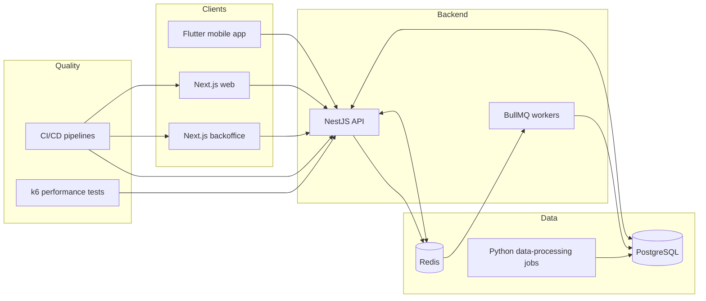
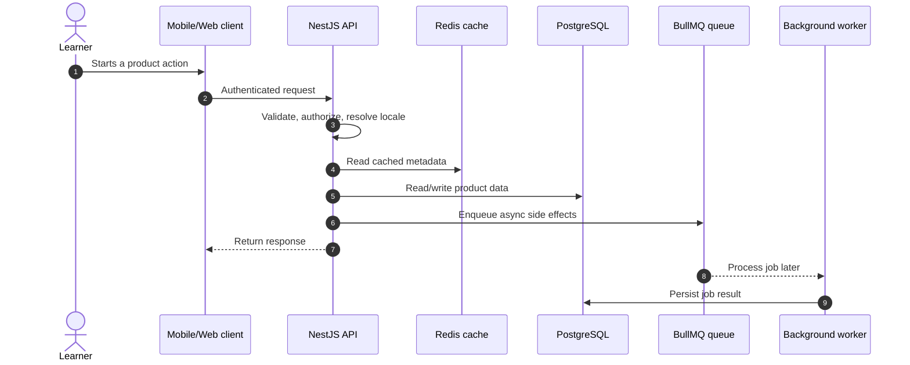
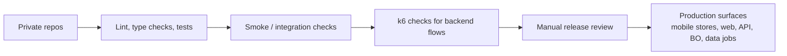
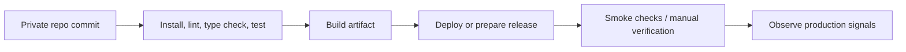

# System Architecture

CVocab is split into separate client apps, a NestJS backend, background workers, data-processing jobs, and a dedicated performance test suite. The split keeps user-facing product work, admin operations, and offline processing from stepping on each other.

## Components

| Component                   | Responsibility                                                                                                             |
| --------------------------- | -------------------------------------------------------------------------------------------------------------------------- |
| Flutter mobile app          | Primary iOS/Android learning experience, authentication, local state, audio/speech, push notifications, subscription flows |
| Next.js web app             | Public and authenticated web experience, localized content, auth integration                                               |
| Next.js backoffice          | Admin workflows for operating content, users, products, versions, queues, promotions, and support tasks                    |
| NestJS API                  | User/admin REST APIs, auth, validation, localization, queue orchestration, database access                                 |
| PostgreSQL                  | Primary relational store                                                                                                   |
| Redis + BullMQ              | Cache layer and asynchronous job queue                                                                                     |
| Workers                     | Email, image processing, notification, webhook, scheduler, review computation, account deletion, and operational jobs      |
| Python data-processing jobs | Internal data preparation, validation, transformation, and import/export workflows                                         |
| k6 test suite               | Smoke/load/stress/spike/endurance testing for critical backend flows                                                       |
| CI/CD pipelines             | Automated build, test, and deployment workflows for the repositories that need release automation                           |

## Container View

See [container-architecture.mmd](../diagrams/container-architecture.mmd).

## Request Lifecycle

See [request-lifecycle.mmd](../diagrams/request-lifecycle.mmd).

## Release And Quality Gates

See [release-overview.mmd](../diagrams/release-overview.mmd).

## CI/CD

See [ci-cd-overview.mmd](../diagrams/ci-cd-overview.mmd).

All release-critical repositories have CI/CD automation. Each pipeline is shaped around the same idea: run repeatable checks close to the codebase, build the deployable artifact, then verify the release path before production traffic depends on it.

## Key Design Decisions

- Separate mobile/web/backoffice clients so user-facing product work and internal operations can evolve independently.
- Keep the backend as the contract boundary for authentication, validation, localization, user data, purchases, and review workflows.
- Move slow or unreliable work into queues and workers, especially email, notification, image processing, scheduled jobs, webhook handling, and review computations.
- Keep internal data processing outside the API runtime so operational jobs do not compete with user traffic.
- Maintain a dedicated k6 repository so performance tests can be run independently from feature development.
- Use CI/CD quality gates so common checks run consistently before release or deployment.
