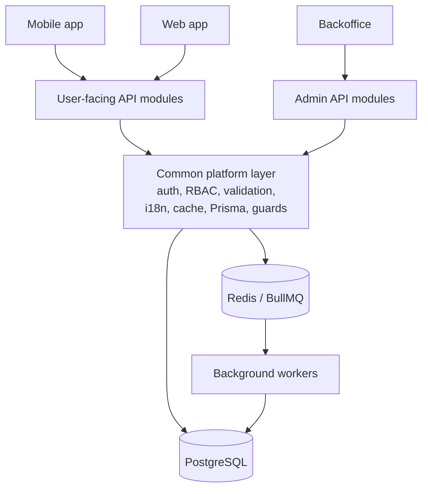
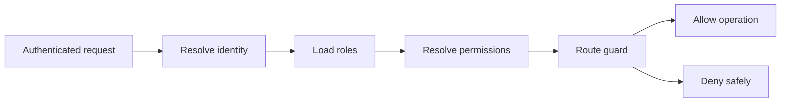
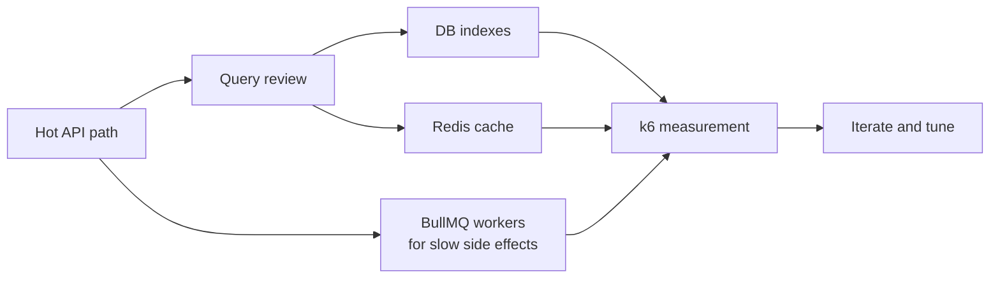

# Backend API

The backend is a NestJS API serving mobile, web, and backoffice clients. It owns authentication, validation, localization, persistence, queues, and operational worker orchestration.

## Stack

- NestJS and TypeScript.
- Prisma with PostgreSQL.
- Redis and BullMQ.
- JWT/OAuth-based authentication.
- RBAC authorization for admin and protected operations.
- DTO validation and transformation.
- Swagger/OpenAPI documentation.
- Jest and e2e testing setup.
- Background workers for asynchronous and scheduled work.
- CI/CD checks for repeatable build/test/deploy workflows.

## API Boundaries

The backend separates user-facing APIs from backoffice/admin APIs. That keeps product traffic and operational tooling behind different module boundaries while still sharing the same platform layer for auth, validation, localization, caching, and persistence.

See [backend-boundaries.mmd](../diagrams/backend-boundaries.mmd).

User-facing capabilities include:

- Auth and account flows.
- App version/system metadata.
- Learning, review, result, topic, search, subscription, notification, and order-related APIs.
- Webhook handling for external systems.

Backoffice capabilities include:

- Admin authentication and authorization.
- Content and vocabulary operations.
- User, subscription, order, promotion, coupon, version, queue, and operational management.

## RBAC Authorization

See [rbac-flow.mmd](../diagrams/rbac-flow.mmd).

RBAC keeps protected operations explicit and reviewable. The role matrix itself belongs in the private codebase, but the flow is straightforward:

- Authenticate the caller.
- Resolve assigned roles and permissions.
- Check route/module-level requirements through guards.
- Allow, deny, or return a safe error response.
- Keep admin authorization separate from normal user-facing flows.

## Worker Architecture

See [async-workers.mmd](../diagrams/async-workers.mmd).

Workers handle side effects and scheduled work that would make API requests slower or more fragile if they ran inline:

- Email delivery.
- Image processing.
- Notification sending.
- Scheduler tasks.
- Webhook processing.
- Account deletion workflows.
- Review-related computation.

## Performance Work

See [performance-optimization.mmd](../diagrams/performance-optimization.mmd).

Performance work focused on two questions: what can be made cheaper in the hot path, and what can be moved out of it entirely.

- Added database indexes for frequent lookup, filtering, sorting, and join-heavy access patterns.
- Used Redis caching for stable or frequently requested metadata.
- Moved slow side effects out of synchronous API requests and into BullMQ workers.
- Kept scheduled and retryable work in workers so user requests stay predictable.
- Used k6 smoke/load/stress tests to measure critical API flows and catch regressions early.
- Reviewed heavy list/search/review endpoints with query shape, pagination, payload size, and cacheability in mind.

## Engineering Notes

- Request validation and response shaping are kept near DTO/module boundaries.
- Localization is handled consistently for user-facing messages and content locale needs.
- Redis is used both as a cache and as the queue backing store.
- Workers communicate through persisted data and queue payloads rather than long synchronous chains.
- Backoffice routes are isolated from user-facing API concerns.
- RBAC keeps admin capabilities explicit instead of relying on UI-only restrictions.
- Performance-sensitive endpoints are treated as database, cache, and API-shape problems together rather than only code-level problems.
