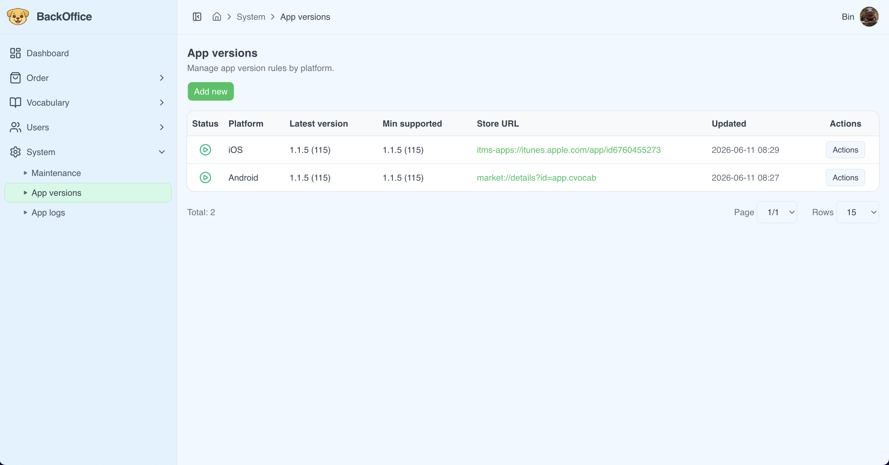
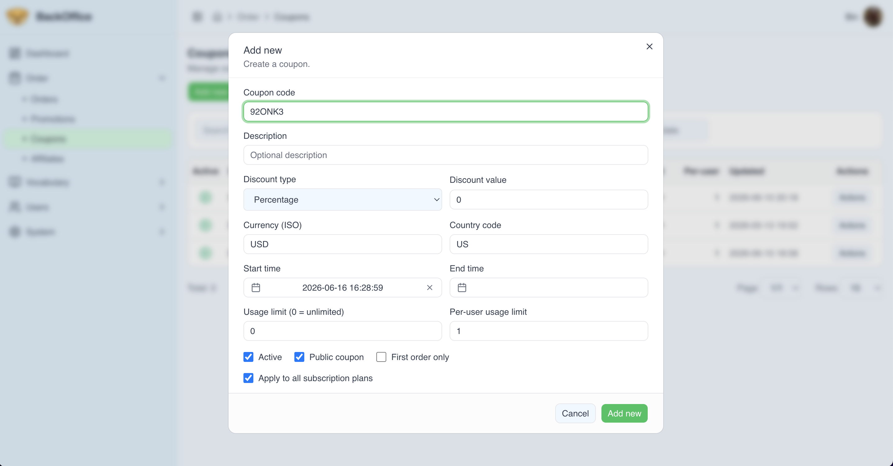
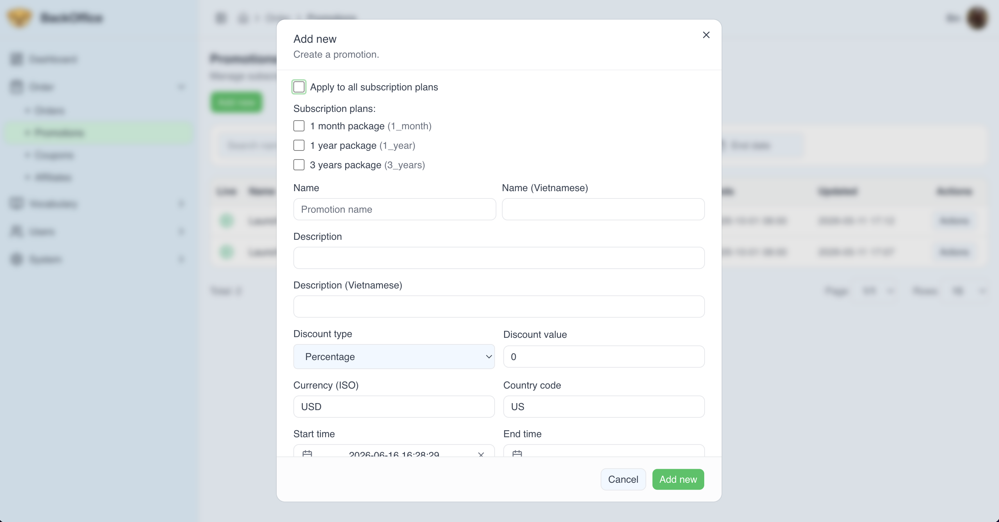

# Backoffice

The backoffice is the internal operations surface for managing CVocab. It is built separately from the public web app so operational workflows can move quickly without affecting the user-facing product.

## Stack

- Next.js and React.
- TypeScript.
- NextAuth.
- next-intl.
- TanStack React Query.
- TanStack React Table.
- React Hook Form and Zod.
- Radix/shadcn-style UI components.

## Operational Areas

- Authentication and authorization.
- CRUD-oriented content operations.
- User and support workflows.
- Product, subscription, coupon, promotion, and order management.
- Queue and app-version visibility.
- Localized admin experience.

## Screenshots

The screenshots below show the type of operational tooling the backoffice provides: content management, app-version control, and commercial workflows.

| Word management                                                                                      | App version management                                                                                               |
| ---------------------------------------------------------------------------------------------------- | -------------------------------------------------------------------------------------------------------------------- |
|  |  |

| Coupon creation                                                                                          | Promotion creation                                                                                             |
| -------------------------------------------------------------------------------------------------------- | -------------------------------------------------------------------------------------------------------------- |
|  |  |

## Engineering Notes

- Data-heavy views use table and query abstractions for scanning, filtering, and repeated operations.
- Forms use schema validation to reduce invalid admin input.
- Authorization concerns are separated from general UI components.
- Backoffice API access is isolated from public web behavior.
