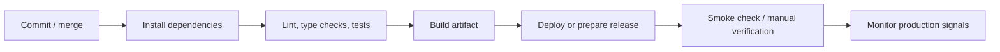

# CI/CD

All repositories that need build, release, or deployment automation have CI/CD. The pipelines are not identical, but they follow the same operating model: install dependencies, run checks, build an artifact, deploy or prepare a release, then verify the result.

## Coverage

| Repository             | CI/CD role                                                              |
| ---------------------- | ----------------------------------------------------------------------- |
| `Flutter cv-app`       | Build and release preparation for mobile app delivery                   |
| `NestJS cv-api`        | Backend build, test, and deployment workflow                            |
| `NextJS cv-web`        | Web build and deployment workflow                                       |
| `NextJS cv-bo`         | Backoffice build and deployment workflow                                |
| `Python cv-data`       | Data-processing job packaging/deployment workflow                       |
| `Load test cv-be-test` | Performance test suite; not treated as an application deployment target |

## Pipeline Shape

See [ci-cd-overview.mmd](../diagrams/ci-cd-overview.mmd).

