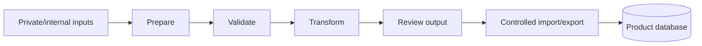

# Data Processing

The data-processing repository handles internal automation outside the API runtime. Keeping it separate protects API latency and makes long-running operational jobs easier to run, retry, and review.

## Stack

- Python.
- Data-processing scripts and handlers.
- Batch-oriented workflows.
- Validation and transformation utilities.
- PostgreSQL access for controlled import/export workflows.
- Environment-driven configuration for local and production-like runs.

## Processing View

See [data-pipeline.mmd](../diagrams/data-pipeline.mmd).

## Engineering Notes

- Long-running data work is handled outside the production API.
- Work is batched so failures can be retried without restarting the entire process.
- The workflow is separated from user traffic to protect API latency.
- Import/export steps are controlled and reviewed before product data is updated.
- Configuration is environment-driven so the same operational pattern can run locally or in production-like contexts.
