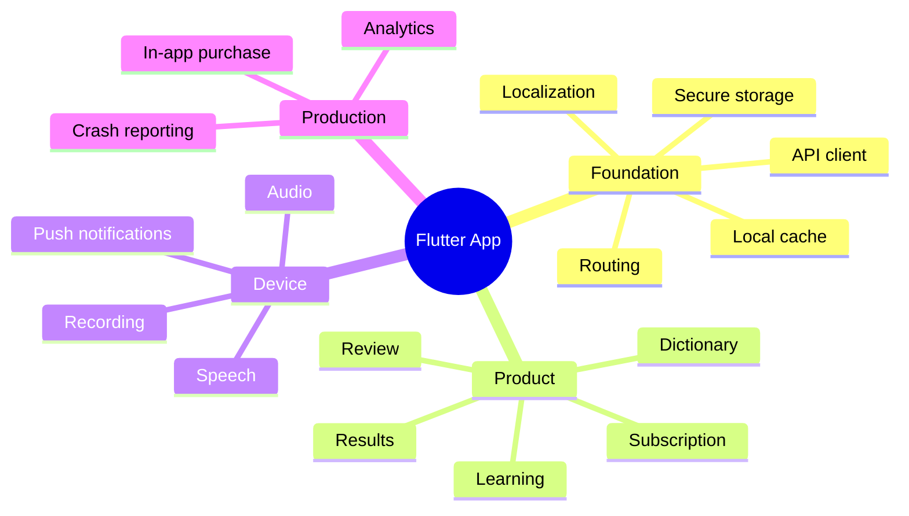
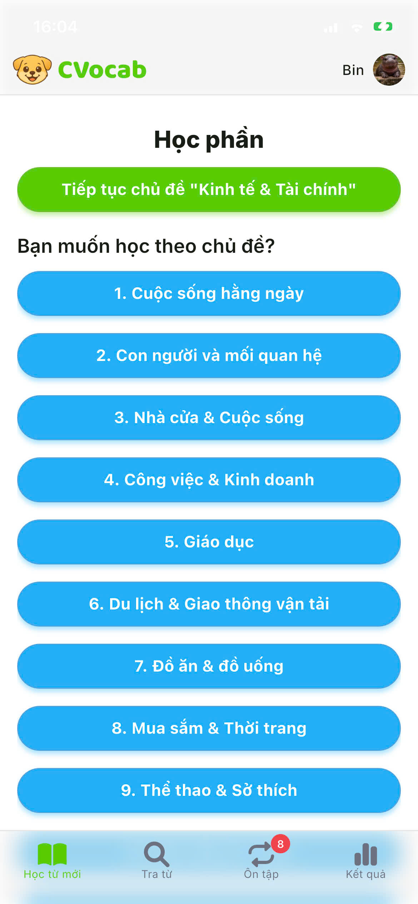
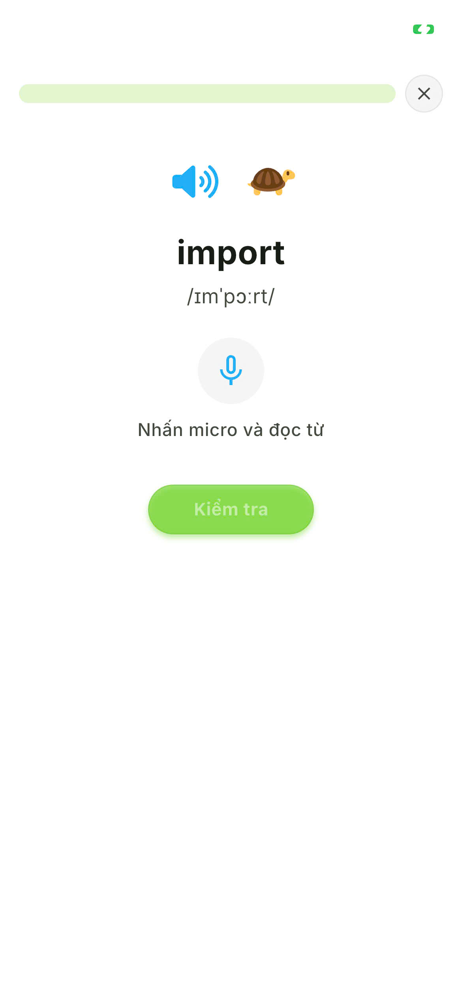
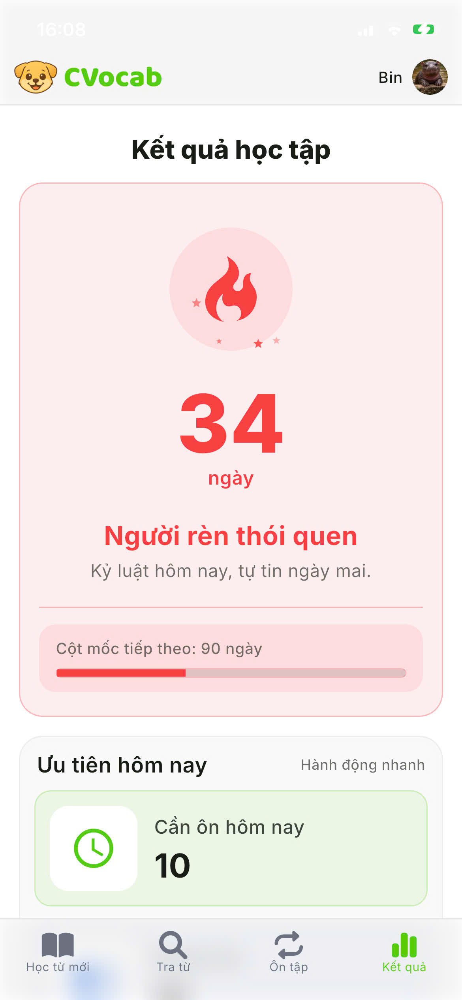
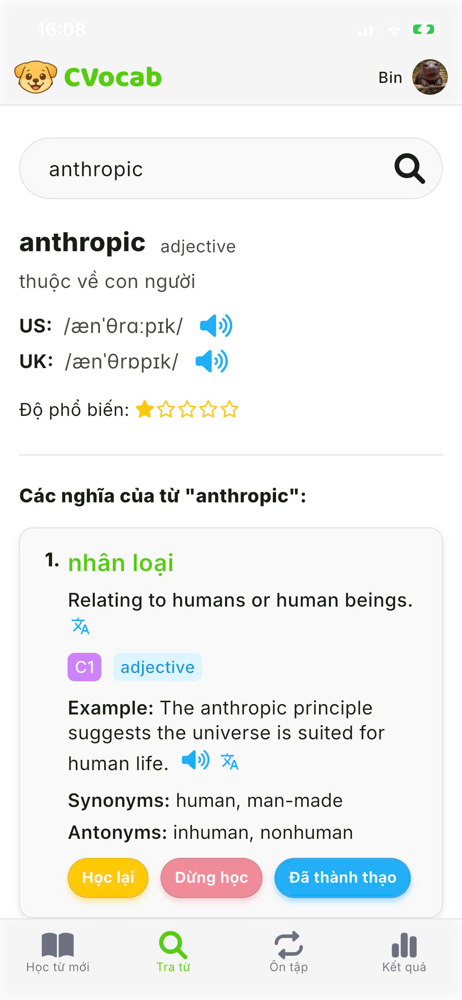
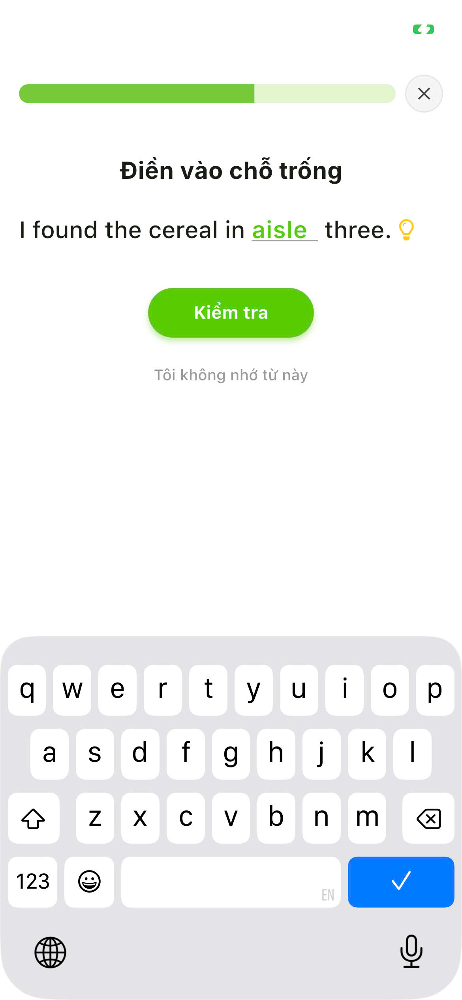
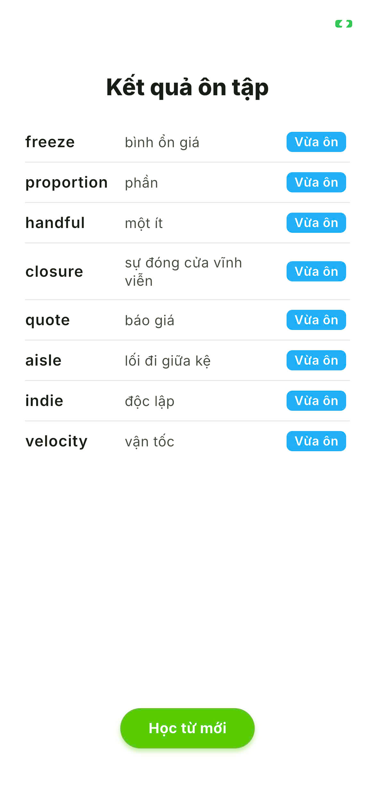

# Mobile App

The Flutter app is the primary iOS and Android client for CVocab. It is designed as a production app rather than a demo: it includes authentication, local state, push notifications, crash reporting, analytics, audio/speech features, subscription flows, and app lifecycle handling.

## Stack

- Flutter and Dart.
- Riverpod for state management.
- GoRouter for navigation and route guards.
- Dio for API communication.
- Secure storage, shared preferences, and Hive for local persistence/cache.
- Firebase Messaging, Crashlytics, and Analytics.
- Local notifications, app badge, timezone handling, device/package metadata.
- Google, Facebook, and Apple sign-in.
- In-app purchase integrations for Android and iOS.
- Audio and speech features through playback, recording, and speech-to-text packages.

## Feature Areas

- Account and authentication.
- Dictionary and word lookup.
- Learning and review flows.
- Results and progress views.
- Subscription and purchase handling.
- Profile, policy, FAQ, and localized content.
- Push notification and background task handling.

## Feature Map

See [mobile-feature-map.mmd](../diagrams/mobile-feature-map.mmd).

## Screenshots

These screenshots highlight the mobile learning experience and device-level features.

| Learning topics                                                                             | Speech practice                                                                             | Result statistics                                                                            |
| ------------------------------------------------------------------------------------------- | ------------------------------------------------------------------------------------------- | -------------------------------------------------------------------------------------------- |
|  |  |  |

| Dictionary                                                                                  | Review cloze                                                                                      | Review summary                                                                               |
| ------------------------------------------------------------------------------------------- | ------------------------------------------------------------------------------------------------- | -------------------------------------------------------------------------------------------- |
|  |  |  |
