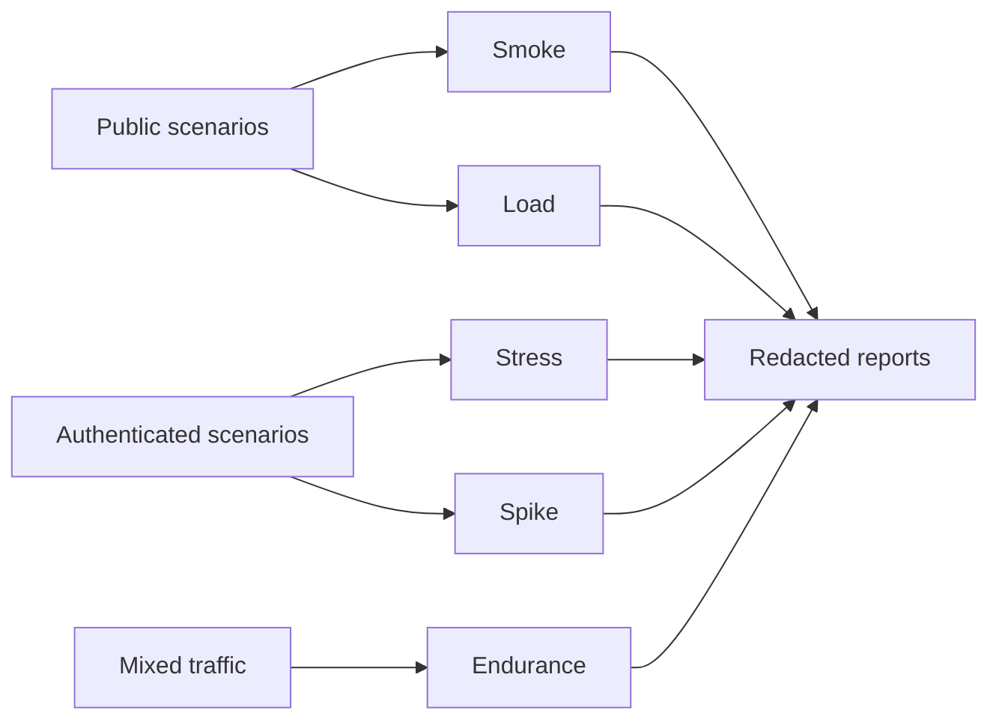

# Performance Testing

The performance test suite uses k6 to test critical backend flows independently from product source code. It includes public and authenticated scenarios and separates smoke, load, stress, spike, and endurance profiles.

## Stack

- k6.
- JavaScript test scenarios.
- Environment-based configuration.
- Structured result output for local and CI review.

## Scenario Groups

- Public API smoke checks.
- Authenticated API smoke checks.
- Login/auth-related flows.
- Card review and review list flows.
- Results overview.
- Bulk update behavior.
- Word search suggest/search behavior.
- Mixed load, stress, spike, and endurance tests.

## Test Strategy

See [testing-strategy.mmd](../diagrams/testing-strategy.mmd) and [testing-matrix.mmd](../diagrams/testing-matrix.mmd).

## Engineering Notes

- Public and authenticated scenarios are separated.
- Authenticated tests use short-lived test credentials/tokens outside the repository.
- Workload profiles and thresholds live in configuration rather than being hard-coded inside each test.
- Reports are generated per run, which makes it easier to compare changes over time.
- Production runs use conservative profiles; heavier profiles are kept for controlled environments.
