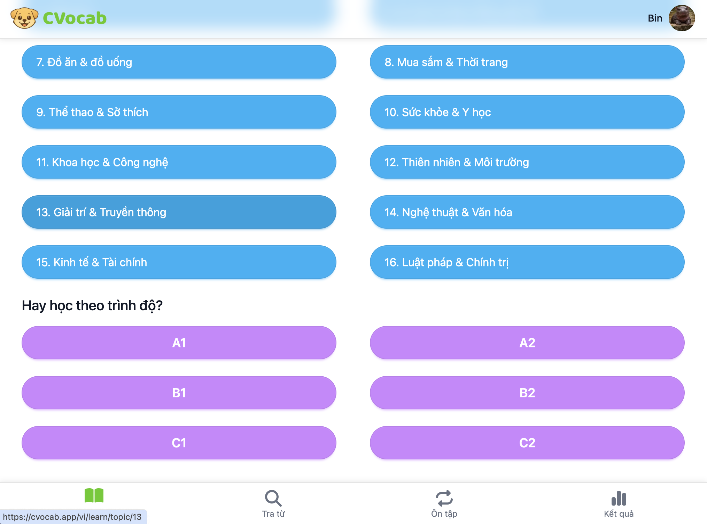
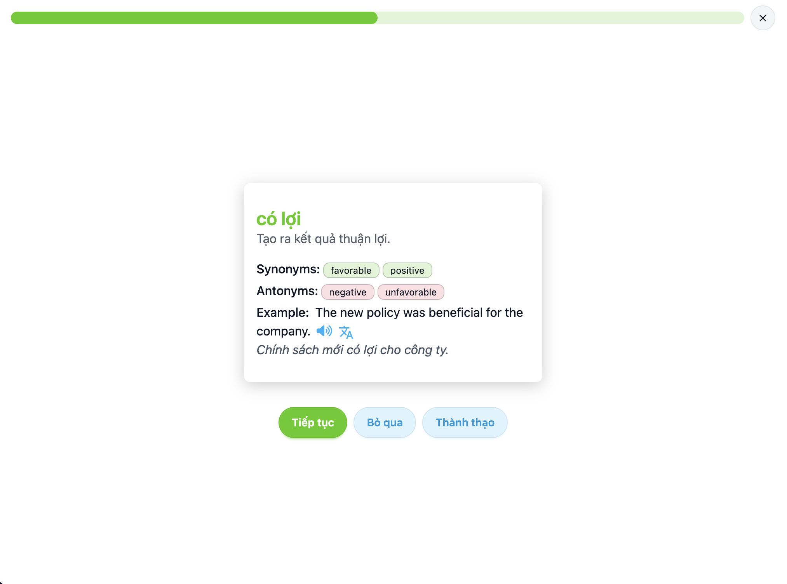
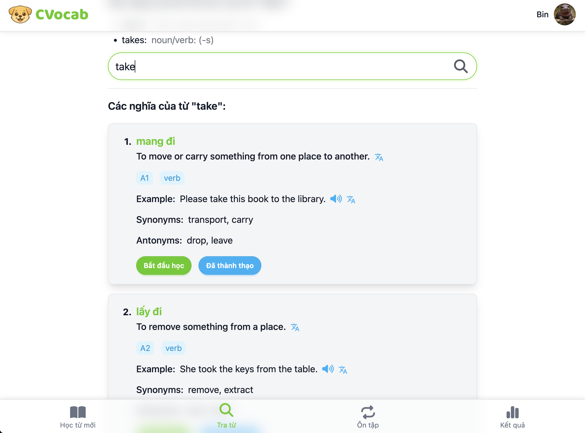
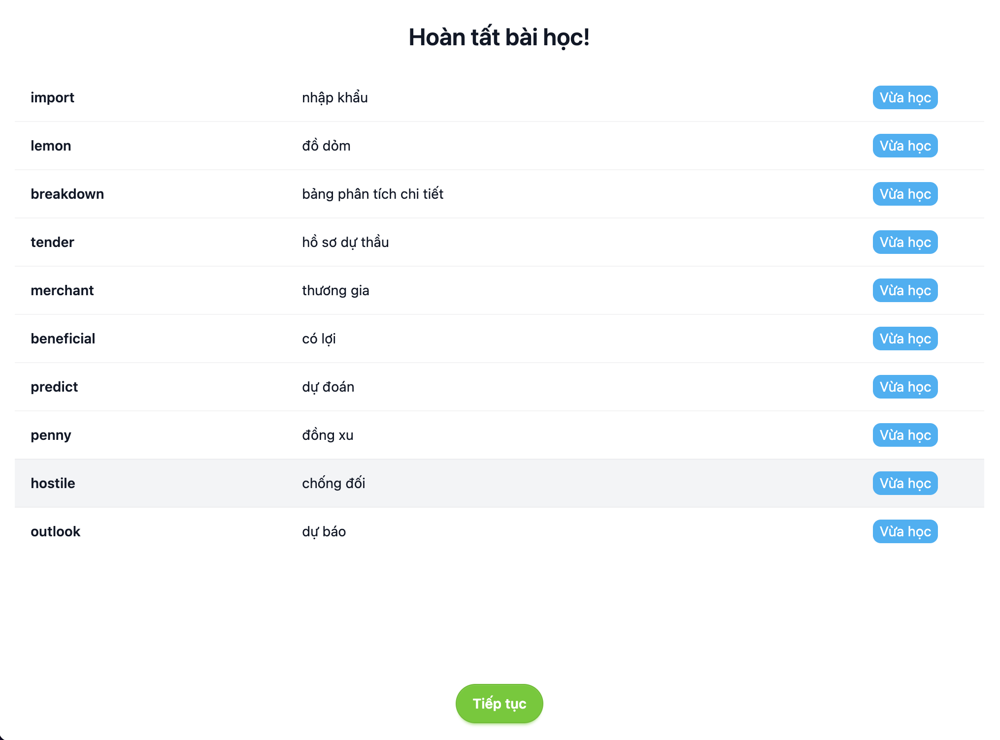

# Public Web App

The public web app is the browser-facing experience for CVocab. It supports localized pages, authentication, public content, and authenticated user surfaces.

## Stack

- Next.js and React.
- TypeScript.
- NextAuth integration.
- next-intl for localization.
- MDX content support.
- Tailwind CSS.
- SWR for client data fetching.

## Responsibilities

- Public product/content pages.
- Authenticated user web experience.
- Locale-aware routing and content.
- API integration with the NestJS backend.
- Shared layout, UI components, providers, and auth components.

## Screenshots

These screenshots show the browser learning experience and parity with the mobile product surface.

| Learning topics                                                                                | Flashcard learning                                                                                   |
| ---------------------------------------------------------------------------------------------- | ---------------------------------------------------------------------------------------------------- |
|  |  |

| Dictionary                                                                                     | Learning summary                                                                                 |
| ---------------------------------------------------------------------------------------------- | ------------------------------------------------------------------------------------------------ |
|  |  |

## Engineering Notes

- Public and authenticated areas are separated by route groups.
- Localized content is organized separately from application logic.
- Auth integration stays close to framework routing and API boundaries.
- The web app consumes backend APIs rather than duplicating backend business rules.
